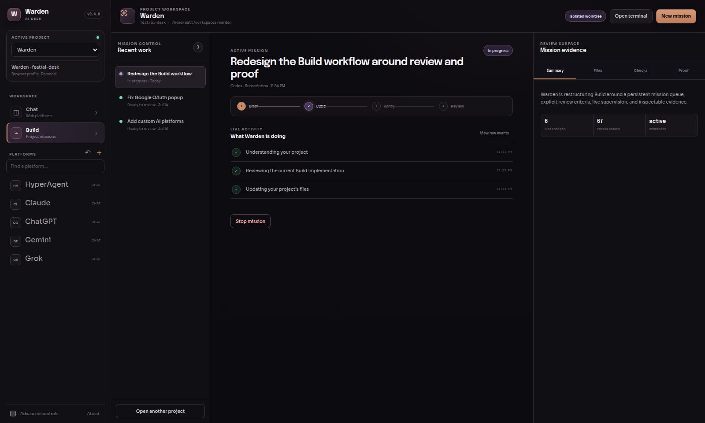
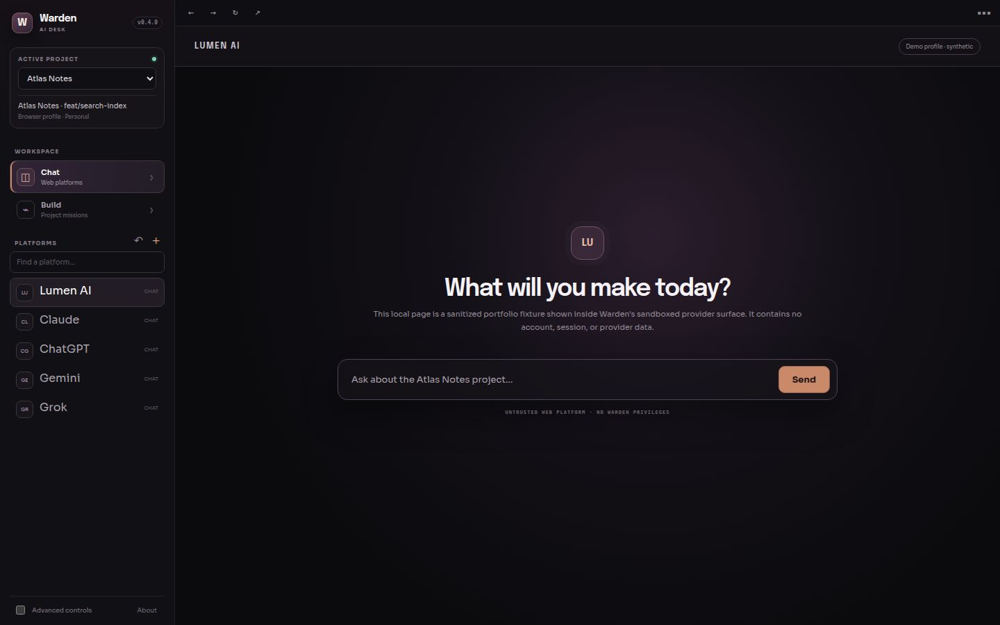
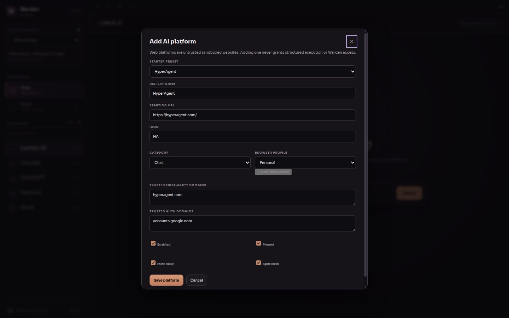
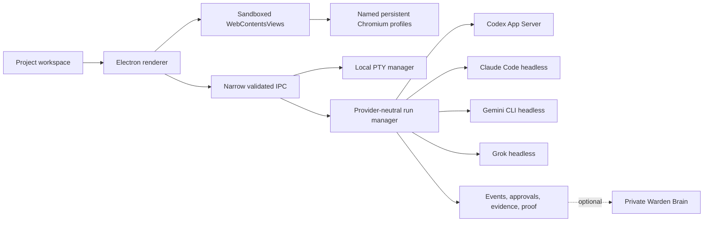

# Warden AI Desk

**A subscription-first Linux workstation that keeps AI conversations, local project tools, and structured agent work in one durable project workspace.**

[](https://github.com/matthewjmcbridejr-code/Warden/actions/workflows/desktop-ci.yml)
[](LICENSE)



Warden is more than a browser with AI tabs. A project restores its repository, browser profile, provider workspaces, split layout, terminal references, structured runs, context, approvals, evidence, and handoffs. Chat remains a safe web surface; Build uses official locally authenticated provider clients and records what happened.

> **Release candidate:** 0.4.0 targets Debian/Ubuntu on x86-64. Provider subscriptions and local clients are not bundled.



## Two surfaces, one project

| Chat | Build |
|---|---|
| Persistent Claude, ChatGPT, Gemini, Grok, HyperAgent, and custom websites | Local PTYs plus structured Codex, Claude Code, Gemini CLI, and Grok runs |
| Named Chromium profiles; no Chrome-cookie import | Subscription authentication owned by each official client |
| Sandboxed remote content with no Warden preload or privileged IPC | Durable events, approvals, cancellation, evidence, proof, and handoffs |
| OAuth popups stay visible in the originating profile | API-key billing is an explicit per-run fallback, never a silent choice |



## What works today

- Project-centered restoration across Chat, Build, browser profile, platform selection, execution mode, terminals, and runs.
- Persistent sandboxed provider sessions and editable custom Web Platforms with HyperAgent and other ordinary starter presets.
- Secure OAuth popup/redirect handling with visible domain-trust decisions.
- Managed local project terminals with restartable metadata and private command history.
- Codex App Server threads, streamed events, bidirectional approvals, cancellation, resume, evidence, and proof.
- Simple Build is a project command center with a durable mission queue, explicit review criteria, live phase/activity supervision, approval interrupts, and file/check/proof inspection. Codex runs in an isolated Git worktree and applies ordinary uncommitted agent edits only after **Apply to project**. Undo creates a separate revert commit.
- Subscription-first headless adapters for Claude Code, Gemini CLI, and Grok when their installed client and entitlement support it.
- Compact cross-provider handoffs and repository context packs with instructions, skills, git state, scoped memories, and optional private Warden Brain context.
- Crash-safe JSON persistence, corrupt-state recovery, a tray, keyboard navigation, and a native overflow menu that renders above remote content.

## Provider capability matrix

“Subscription” means Warden invokes the official local client and leaves sign-in/token refresh to it. Availability still depends on the client version, account, region, and plan.

| Integration | Web workspace | Persistent session | Subscription auth | Structured Build | Approval bridge | Resume | Current limitation |
|---|:---:|:---:|:---:|:---:|:---:|:---:|---|
| ChatGPT / Codex | Yes | Yes | Yes, `codex login` | **Codex App Server** | **Yes** | Yes | Requires a compatible installed Codex client |
| Claude / Claude Code | Yes | Yes | Yes, Claude Code login | Headless stream | No | Yes | Official stream does not expose an interactive Warden approval callback |
| Gemini / Gemini CLI | Yes | Yes | Google account / Code Assist entitlement | Headless stream | No | Yes | Entitlement probing varies by Gemini CLI version and may report unknown/unsupported |
| Grok / Grok Build | Yes | Yes | Yes, `grok login` | Headless stream | No | Yes | ACP-grade approval negotiation remains future work |
| HyperAgent | Preset | Yes | Website-owned | No | No | Website only | A Web Platform is not a structured provider |
| Any HTTPS site | Yes | Yes | Website-owned | No | No | Website only | Adding a URL never grants filesystem, terminal, Brain, or execution access |

See the [full capability notes](docs/capability-matrix.md).

## Architecture



Electron/Chromium is intentional: Google and OpenAI authentication is unreliable in many Linux system webviews, while Chromium is the proven compatibility surface used by multi-service desktop wrappers. Remote provider pages run in sandboxed `WebContentsView`s with `nodeIntegration: false`, context isolation, no preload, no script injection, deny-by-default permissions, and constrained navigation. Named profiles use separate `persist:` partitions and never import or decrypt Chrome cookies.

Structured Build is a different trust boundary. Official local clients own authentication. Subscription launches scrub API credential variables; Warden will not silently fall back to API billing. The legacy tmux prompt-injection runner remains isolated in the older service and is not a desktop dependency.

Read [desktop/architecture.md](desktop/architecture.md) and [SECURITY.md](SECURITY.md) for the full boundary model.

## Install on Debian or Ubuntu

Download the 0.4.0 `.deb` and checksum from a future tagged release, then verify before installing:

```bash
sha256sum --check warden-ai-desk_0.4.0_amd64.deb.sha256
sudo apt install ./warden-ai-desk_0.4.0_amd64.deb
warden-ai-desk
```

This branch prepares the artifact but does not publish it. Linux must support Electron's normal Chromium sandbox/AppArmor behavior; Warden does not install a permanent `--no-sandbox` workaround.

## Develop and verify

```bash
git clone https://github.com/matthewjmcbridejr-code/Warden.git
cd Warden/desktop
npm ci
npm run dev          # build and launch
npm run check        # typecheck, tests, production build
npm run package:deb  # local .deb; never publishes
```

The desktop suite covers state recovery, URL policy, profile assignment, OAuth popups, native navigation/menu boundaries, adapters, authentication reporting, events, runs, approvals, context, handoffs, and evidence. See [CONTRIBUTING.md](CONTRIBUTING.md) for the older Python services and contributor workflow.

## Local data and privacy

Desktop state, named Chromium profile data, redacted run records, diagnostics, and proof artifacts live under Electron's per-user application-data directory (normally `~/.config/Warden AI Desk/` on Linux). They are intentionally excluded from Git. Removing a platform does not remove its profile data; clearing site data is a separately confirmed troubleshooting action and can affect related domains sharing the same Warden profile.

Warden never copies OAuth tokens between providers, imports Chrome cookies, or claims a private Brain save succeeded when the service is unavailable. Read [docs/privacy.md](docs/privacy.md) before using sensitive repositories.

## Screenshots

| Provider workspace | Project-centered Build | Custom platform boundary |
|---|---|---|
|  |  |  |

The repository media uses a signed-out provider surface plus synthetic project, prompt, and run data. It contains no provider conversations, credentials, or browser-session data.

## Limitations and roadmap

- Codex is currently the only structured provider with a full Warden-controlled approval bridge.
- Claude Code, Gemini CLI, and Grok client capabilities differ by installed version; Warden reports unavailable or unknown states rather than pretending dispatch is ready.
- Terminal processes do not survive an app/host restart; their metadata restores as stopped sessions.
- Linux x86-64 Debian packaging is the release target; other distributions and architectures are not yet release-proven.
- Brain proof saving requires the separate private Warden service; local proof remains available when it is offline.
- HyperAgent Remote Build Worker, webhook orchestration, and a public Warden worker/MCP protocol are deliberately deferred.

See [ROADMAP.md](ROADMAP.md) and [CHANGELOG.md](CHANGELOG.md).

## Engineering case study

Warden began as a local control room around a CLI/tmux dispatcher. The desktop work required replacing “prompt injection plus terminal scraping” with explicit capability boundaries: untrusted websites, local terminals, and provider-native structured adapters. The hard parts were not tab rendering—they were Chromium profile ownership, secure OAuth popup lifecycles, native-layer UI above `WebContentsView`, subscription-vs-API billing truth, restart-safe event normalization, and evidence that survives a provider handoff.

The result demonstrates Electron security architecture, native/renderer IPC design, durable state recovery, PTY integration, protocol adapters, provider-neutral event modeling, subscription-aware authentication reporting, and testable failure honesty.

Built by **Matt McBride**. Repository: [matthewjmcbridejr-code/Warden](https://github.com/matthewjmcbridejr-code/Warden).

## License

Apache License 2.0. See [LICENSE](LICENSE).
