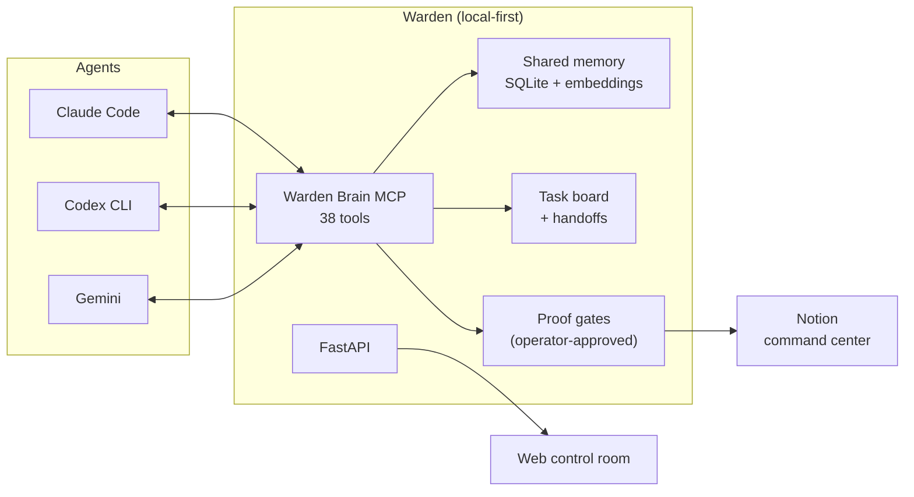

# Warden

**A local-first control room for AI coding agents** — shared memory, task handoffs, proof gates, and a human-visible command center.

Warden exists to answer one question reliably: *"What is going on across all my agents, projects, repos, proofs, failures, and next actions — and what should happen next?"*


## Why this exists

Running multiple coding agents (Claude Code, Codex, Gemini) against the same projects creates three problems Warden solves:

1. **Amnesia** — every agent session starts cold. Warden gives all agents a shared, queryable memory (decisions, proofs, failures, context packs) over MCP.
2. **Coordination** — agents can't hand work to each other. Warden's task board and handoff protocol let one agent post work with context and another claim it.
3. **Trust** — autonomous agents want to merge and deploy. Warden inserts manual proof gates: an operator approves, blocks, or demands more evidence before anything ships.

## Architecture



- **Warden** — the operator control room (UI + proof gates)
- The HTTP API lives under the `/api/mcharness` namespace (legacy internal name; a rename with aliases is planned)
- **Warden Brain MCP** — the agent-facing surface: any MCP client gets memory, board, and handoffs
- Semantic recall uses **Ollama `mxbai-embed-large`** embeddings with a pure-SQLite cosine fallback — no cloud dependency required

Full details: [docs/architecture.md](docs/architecture.md)

## Quick start

```bash
pip install -e .
warden up
# Opens http://127.0.0.1:6969 in your browser
```

(`bash scripts/warden-up` does the same thing and creates the virtualenv for you.)

Connect an agent (Claude Code example):

```bash
claude mcp add warden -- warden mcp
```

Smoke proof in one command:

```bash
bash scripts/warden_smoke.sh
```

See [docs/quickstart.md](docs/quickstart.md) and [docs/mcp_client_connect.md](docs/mcp_client_connect.md).

## MCP tool surface (38 tools)

| Area | Tools |
|------|-------|
| Identity & session | `warden_bootstrap`, `warden_me`, `warden_update_me`, `warden_health` |
| Shared memory | `warden_recall`, `warden_remember`, `warden_context_pack`, `warden_memory_context`, `warden_ingest`, `warden_search_docs` |
| Coordination | `warden_board`, `warden_post_task`, `warden_claim_task`, `warden_handoff`, `warden_who_is_working`, `warden_workstream`, `warden_agent` |
| Planning & dispatch | `warden_captain_plan`, `warden_captain_recent_plans`, `warden_captain_dispatch_step`, `warden_run_get` |
| Resident assistant | `warden_ask_marius` (assistant Q&A) |
| Connectors & mail | `warden_connectors_providers`, `warden_connectors_accounts`, `warden_mail_*` (4 tools) |
| Second brain vault | `brain_status`, `brain_search`, `brain_ask`, `brain_write_note`, plus ingest/reindex/mirror tools |

## Agents (honest status)

- **Codex CLI** — runnable only on the private service when the tmux/Codex runner flags are enabled
- **Jules Remote** — connected for planning/status only; not executable yet
- **Captain** — OpenRouter planning on the private service; supervised step loop is manual
- **Assistant** — resident terminal assistant with server context: `./scripts/marius` ([docs](docs/marius_cli.md))

## Safety model

Warden is deliberately **not** an autonomous agent framework:

- No arbitrary shell execution through the API
- No auto-merge, no auto-deploy
- No autonomous multi-step execution — the Captain plans; a human dispatches each step
- Proof gates require operator action: approve / block / request more evidence
- The public service mode runs with all runners disabled (read-mostly preview)

See [SECURITY.md](SECURITY.md).

## Testing

```bash
pytest tests --ignore=tests/e2e --ignore=tests/browser
```

**850+ passing tests** cover the memory store, MCP tools, ingest pipeline, mail connectors, brain vault, and the resident assistant. Playwright e2e specs live in `tests/e2e/`.

## Repo layout

```
src/warden/         engine: FastAPI app, MCP server, memory, captain, gateway
web/                control room UI
scripts/            smoke tests, MCP launchers, assistant CLI
tests/              850+ unit/integration tests + Playwright e2e
docs/               architecture, runbooks, demo scripts
browser-extension/  Chrome extension for page capture into memory
```

More: [docs/warden_repo_layout.md](docs/warden_repo_layout.md)

## Docs

- [Architecture](docs/architecture.md)
- [Quickstart](docs/quickstart.md)
- [Operator smoke runbook](docs/warden_operator_smoke.md)
- [Mission Control API](docs/warden_mission_control_api.md)
- [Demo script](docs/warden_demo_script.md)
- [Memory model](docs/warden_memory.md)

## License

See [LICENSE](LICENSE).
