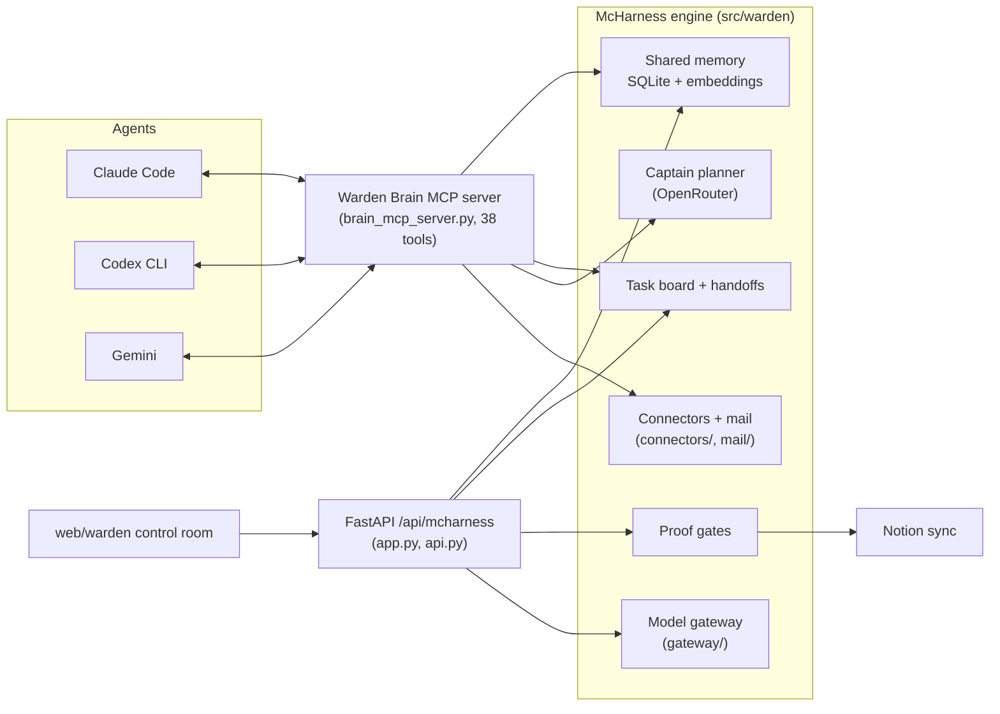

# Warden architecture

Warden is a local-first control room for AI coding agents. One process owns the truth (SQLite under `MCHARNESS_DATA_ROOT`); agents reach it over MCP, humans reach it over the web UI and Notion.

## Layers

| Layer | Code | Role |
|-------|------|------|
| MCP server | `brain_mcp_server.py` | Agent-facing surface: identity, memory, board, captain, mail, vault (38 tools) |
| Memory | `brain_embed.py`, `brain_vector_store.py`, `brain/` | Embeddings via Ollama `mxbai-embed-large`; `sqlite-vec` when installed, pure-Python cosine fallback otherwise |
| Second brain vault | `brain/` (vault, index, ingest, mirror, hybrid) | Markdown vault with local + Google-mirrored sources and hybrid answering |
| Coordination | task board / handoff stores | Agents post, claim, and hand off tasks with context packs |
| Captain | `captain.py`, `captain_plans.py` | Plans multi-step work; each step is dispatched manually by the operator |
| Model gateway | `gateway/` | Provider aliases, context budgeting, policy, traces |
| Connectors | `connectors/`, `mail/` | OAuth-backed accounts (e.g. Gmail IMAP) exposed as MCP tools |
| API + UI | `app.py`, `api.py`, `web/` | Mission Control snapshot, run review, proof gates |
| Resident agent | `resident*`/Marius modules, `scripts/marius` | Terminal + Telegram assistant with server context |

## Design decisions

- **Local-first.** All state is SQLite on disk. Embeddings run on local Ollama; if neither Ollama nor `sqlite-vec` is available, search degrades gracefully to a cosine fallback rather than failing.
- **MCP as the only agent surface.** Agents never touch the DB or the HTTP API directly; every capability is an audited MCP tool.
- **Supervised, not autonomous.** The Captain produces plans; a human dispatches each step. Proof gates (approve / block / request evidence) sit between agent output and anything that ships.
- **Two service modes.** The public mode runs read-mostly with all runners disabled; the private mode enables operator-supervised Codex dispatch.

## Naming

- **Warden** — operator control room UI + safety layer
- **McHarness** — engine namespace (`/api/mcharness`)
- **Marius** — resident assistant persona
- **Marius Systems** — product studio
